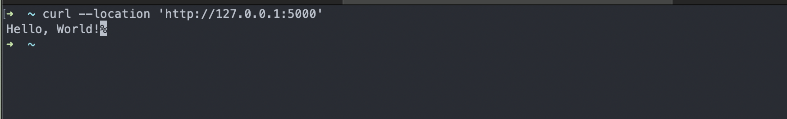
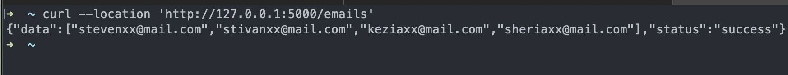
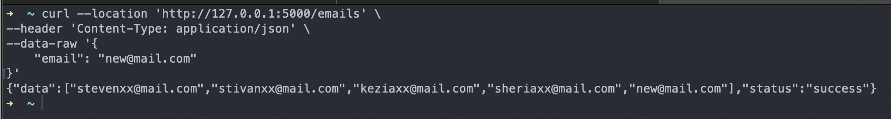

# flask-introduction

## Flask : 
- https://en.wikipedia.org/wiki/Flask_(web_framework)
- https://pythonbasics.org/what-is-flask-python/
- https://flask.palletsprojects.com/en/3.0.x/installation/

## RESTful API
- https://aws.amazon.com/what-is/restful-api/
- https://developer.mozilla.org/en-US/docs/Web/HTTP/Status
---
### How to run server :rocket:
server will running on port 5000 by default: http://127.0.0.1:5000
```commandline
flask --app main run
```
---
### how to test :white_check_mark:
- GET
```commandline
curl --location 'http://127.0.0.1:5000'
```



---

```commandline
curl --location 'http://127.0.0.1:5000/emails'
```



- POST
```commandline
curl --location 'http://127.0.0.1:5000/emails' \
--header 'Content-Type: application/json' \
--data-raw '{
    "email": "new@mail.com"
}'
```


